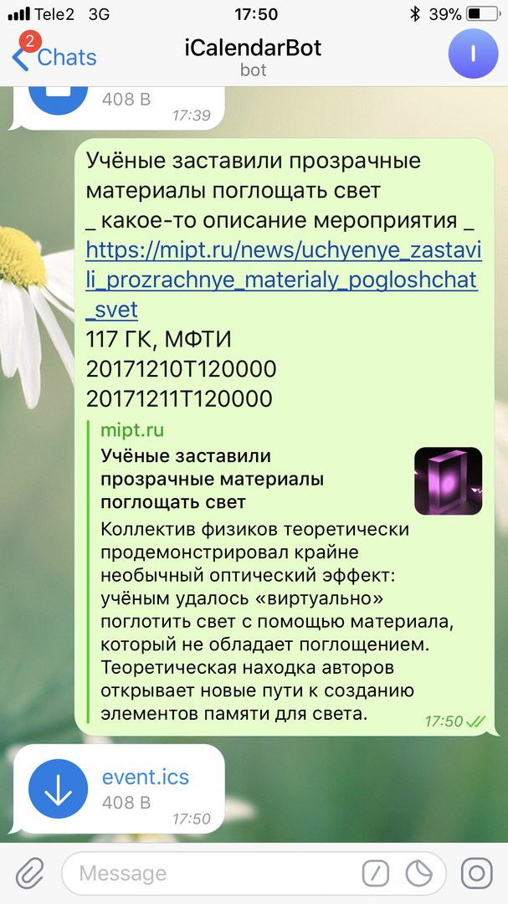
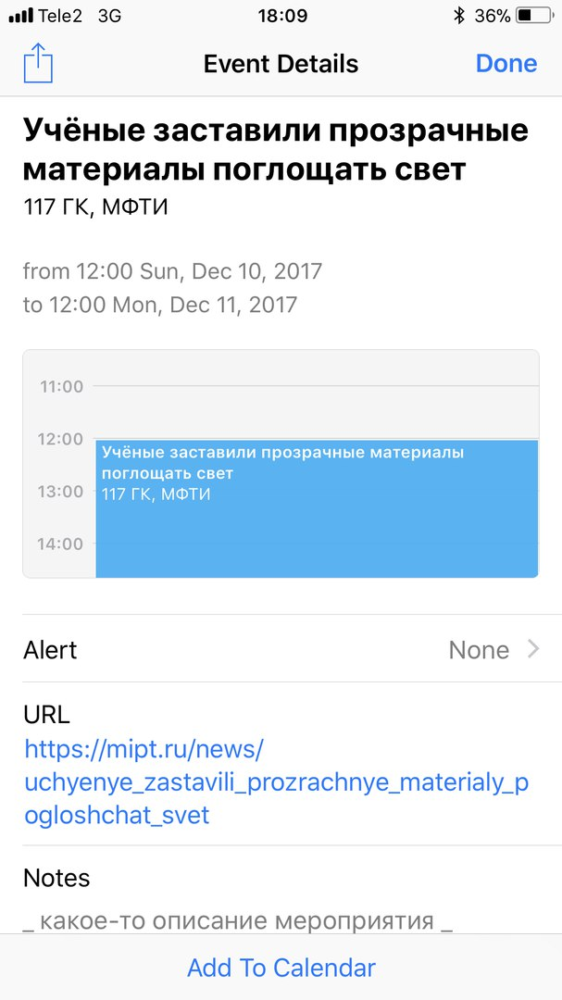

# iCalendarBot

 

## Usage
Send to bot 6 one-liners:

    <title>
    <description>
    <url>
    <location>
    <YYYY><MM><DD>T<hh><mm><ss> - start date
    <YYYY><MM><DD>T<hh><mm><ss> - end date

### For example
    Учёные заставили прозрачные материалы поглощать свет
    Коллектив физиков из России, Швеции и США теоретически продемонстрировал крайне необычный оптический эффект: учёным удалось «виртуально» поглотить свет с помощью материала, который не обладает поглощением. Теоретическая находка авторов открывает новые пути к созданию элементов памяти для света. Работа опубликована в журнале Optica.
    https://mipt.ru/news/uchyenye_zastavili_prozrachnye_m..
    117 ГК, МФТИ
    20171210T120000
    20171211T120000

## [Demo](https://t.me/i_calendar_bot)
